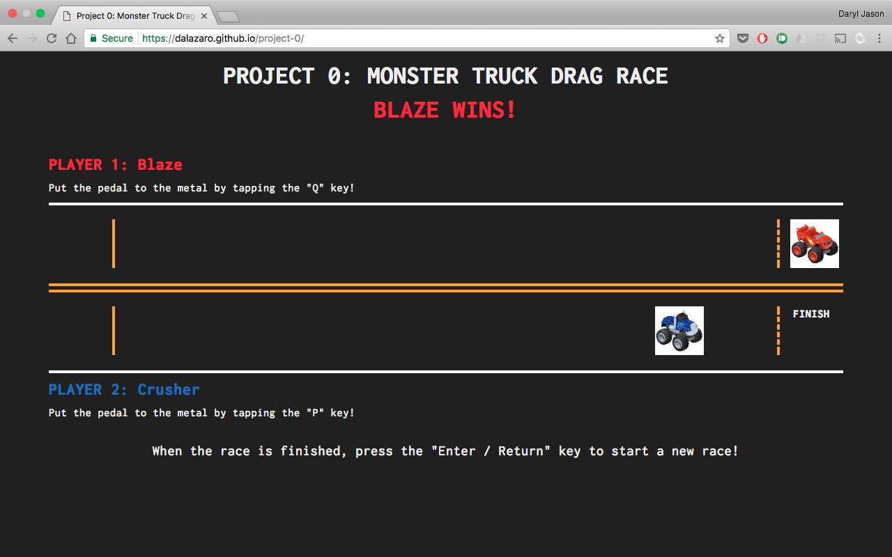

<!-- A `readme.md` file** with a short description of the project, a list of which technologies you used for which parts of the app, an explanation of your approach (share some part of the code), and optionally a list of unsolved problems,  screenshots, etc.  See the [example readme](https://github.com/sf-wdi-labs/readme-example). -->


# Project 0: Monster Truck Drag Race - [https://dalazaro.github.io/project-0/](https://dalazaro.github.io/project-0/)

**Programmed by Daryl Jason Lazaro (WDI 39, San Francisco)**

*This repository contains the working file for my Project 0 game, a monster truck drag race based on characters from the TV show "Blaze and the Monster Machine". Gameplay is optimized for Google Chrome on a desktop or laptop computer. The objective of the game is to take the wheel of either Blaze or Crusher, and race your opponent to the finish line!*

View the game at [https://dalazaro.github.io/project-0/](https://dalazaro.github.io/project-0/)!

View the repository at [https://github.com/dalazaro/project-0](https://github.com/dalazaro/project-0).

## Technologies Used

<li> jQuery </li>
<li> JavaScript </li>
<li> HTML </li>
<li> CSS </li>
<li> Bootstrap </li>

## Screen Shots




## Code I'm Proud Of

I'm really proud of this entire project, because it's the first assignment I've completed where I did not have to look at a solution! I wrote everything from scratch, and my only troubleshooting and how-to references were online resources (MDN, w3, JQuery documentation) and help from people in the cohort!

Here's one block of code I'm particularly proud of:

```javascript
$(document).on("keydown", function player1_keydown(event) {

  qKeycode = event.keyCode;

  //the faster player1 taps the Q key (keyCode 81) while the game is in progress, the faster the red truck will move to the right.
  if (qKeycode === 81 && inProgress) {

    player1_turn += 1;

    //to simulate car shifting, the turn count between intervals gets shorter the farther the truck has traveled
    if (player1_turn === 3) {
      $("#box101 img").remove();
      $("#box102").html(``);
    } else if (player1_turn === 6) {
      $("#box102 img").remove();
      $("#box103").html(``);
    } else if (player1_turn === 9) {
      $("#box103 img").remove();
      $("#box104").html(``);
    } else if (player1_turn === 11) {
      $("#box104 img").remove();
      $("#box105").html(``);
    } else if (player1_turn === 13) {
      $("#box105 img").remove();
      $("#box106").html(``);
    } else if (player1_turn === 15) {
      $("#box106 img").remove();
      $("#box107").html(``);
    } else if (player1_turn === 17) {
      $("#box107 img").remove();
      $("#box108").html(``);
    } else if (player1_turn === 18) {
      $("#box108 img").remove();
      $("#box109").html(``);
    } else if (player1_turn === 19) {
      $("#box109 img").remove();
      $("#box110").html(``);
    } else if (player1_turn === 20) {
      $("#box110 img").remove();
      $("#box111").html(``);
    } else if (player1_turn === 21) {
      $("#box111 img").remove();
      $("#box112").html(``);
      player1_alert();
    };

  };

});
```

I'm proud of this code because it required me to combine several concepts I researched in order to make my game operate. Using the `keydown` and `.remove` methods, as well as the `event.keyCode` property, I was able to assign specific keys that make each of my trucks move across the screen.

## Unsolved Problems

<li> How to create a reset button that doesn't completely reload the page </li>
<li> Keeping score with each new game </li>
<li> Putting an autostart 3-second countdown before the race starts </li>

## Conceptualizing the Game

View the user stories and game conceptualization at [https://github.com/dalazaro/oop-game-training](https://github.com/dalazaro/oop-game-training).
